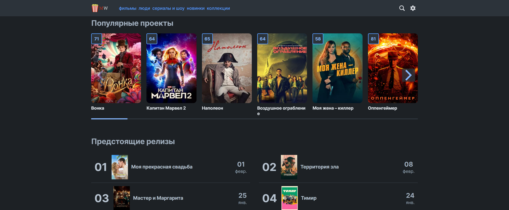
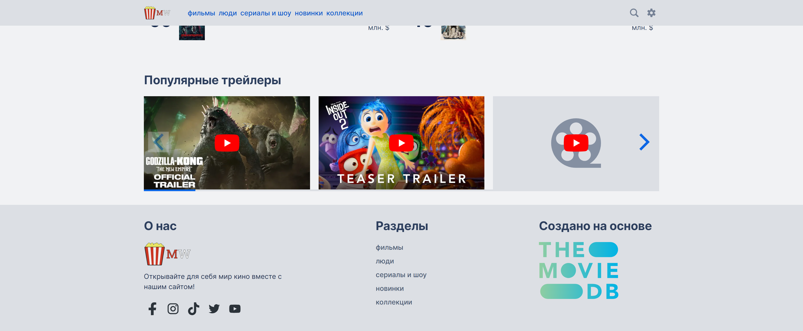
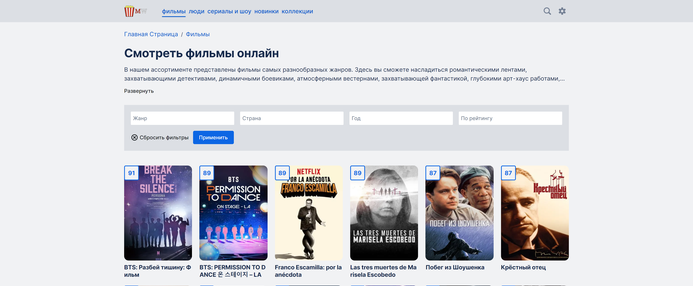

# 🎥 Кино портал
[Cсылка на демо](https://movie-app-eosin-gamma.vercel.app/)








## Технологии которые использовались при создании


## 📄 Описание проекта
Приложение объединяющее информацию о фильмах, телесериалах, актерах, режиссерах и других интересных вещей связанных с кинематографом, для тех кто действительно интересуется этой индустрией.

Само веб приложение состоит из следующих страниц:
- Главная страница.
- Страница с фильмами.
- Страница с сериалами.
- Страница с популярными персонами в кино.
- Страница с коллекциями сериалов и фильмов.
- Страница с деталями о фильме.
- Страница с деталями о сериале.
- Страница с деталями о кино персоне.
- Страница со списком фильмов и сериалов для каждой отдельной коллекции.
- Страница со списком сезонов сериала.
- 404 страница.

Кратко пробежимся по тому что полезного для себя вы можете найти в этом приложении:

- На главной странице вы можете найти слайдер с актуальными фильмами и сериалами, календарь будущих релизов, кассовые сборы, трейлеры будущих проектов.
- На странице с фильмами вас ждет поиск с фильтрами которые вы можете настроить под свои цели.
- Страница с сериалами состоит из слайдеров с проектами разделенных по жанрам
- На странице с коллекциями вы найдет подборки фильмов и сериалов по разным категориям, например Marvel, DC, Cyberpunk и многое другое.
- Внутри страниц с деталями о фильмах, сериалах, персонах, вы можете более подробно ознакомиться об интересующих вас вещах, например найти фильмографию актера, или какие кассовые сборы собрал тот или иной фильм.  

Данные о книгах загружаются из TMDB API

## 🛠️Как запустить проект
1. Клонировать это репозиторий с помощью команды:

`git clone https://github.com/eduardvorsin/movie-app.git`

2. Установить нужные зависимости используя следующую команду
```
$ npm i
```
3. Запустить приложение

Для запуска в режиме разработки
```
$ npm run dev
```
Для сборки build версии проекта
```
$ npm run build
```

## ✨ Особенности
- Удобный поиск фильмов по фильтрам, например по годам, жанрам, странам.
- Возможность получать информацию о грядущих релизах.
- Предоставление детальной информации почти о каждом фильме и сериале, включая актерский состав, съемочную группу, трейлеры, отзывы, а также связи с другими работами в индустрии.
- Есть переключатель темы приложения.
- Доступно переключение языка с русского на английский.
